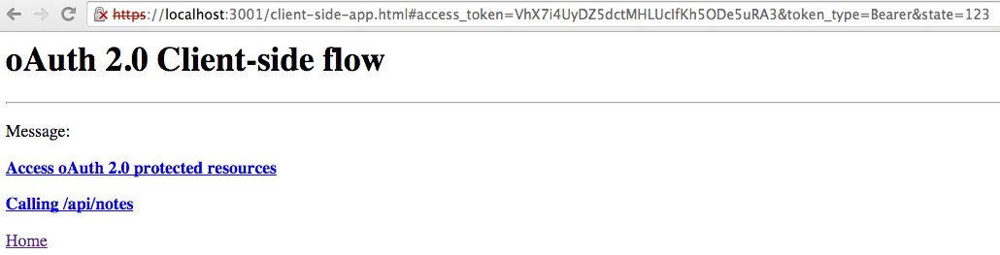

# loopback-gateway

`loopback-gateway` is an example application to demonstrate how to build
an API gateway using LoopBack.

## What is an API gateway

The API gateway is a component within systems architecture to externalize, 
secure and manage APIs.  The API gateway sits as an intermediary between the 
many consumers of APIs - API clients  and the many producers of the APIs on the
backend - API servers. 

You can see more information at:

http://strongloop.com/strongblog/open-source-node-js-api-gateway/

## The basic features

In this tutorial, we'll build a simplified version of API gateway using LoopBack.
The gateway supports basic features listed below:

- HTTPS: make sure all communication will be done with https
- oAuth 2.0 based authentication & authorization: authenticate client 
applications and authorize them to access protected endpoints with approval from
resource owners
- Rate limiting: controls how many requests can be made within a given time 
period for identified api consumers 
- Reverse proxy: forward the requests to the server that hosts the api endpoint

The test scenario consists of three components:
 
- A client application that invokes REST APIs
- A loopback application (api gateway) that bridges the client application and 
the backend api 
- A loopback application (api server) serving the REST APIs 
 
The architecture is illustrated in the diagram below.


## Build the gateway application

The application is initially scaffolded using `slc loopback` command. We 
customize server/server.js to add specific features for the gateway.

### Configure and ensure HTTPS

[oAuth 2.0](http://tools.ietf.org/html/rfc6749#section-10.9) states that the 
authorization server MUST require the use of TLS with server authentication for
any request sent to the authorization and token endpoints.

There are two steps involved:

1. Create the https server for the application

See https://github.com/strongloop/loopback-example-ssl for more details.

2. Redirect incoming http requests to the https urls

```js
var httpsRedirect = require('./middleware/https-redirect');
...
// Redirect http requests to https
var httpsPort = app.get('https-port');
app.use(httpsRedirect({httpsPort: httpsPort}));
```

### Configure oAuth 2.0

The oAuth 2.0 integration is done using [loopback-component-oauth2](https://github.com/strongloop/loopback-component-oauth2).

In our case, we configure the API gateway as both an authorization server and 
resource server.

#### Set up authorization server

The oAuth authorization server exposes the authorization endpoint to allow 
resource owners (users) to grant permissions to authenticated client 
applications. It also creates the token endpoint to issue access tokens to client
applications with valid grants. 

```js
var oauth2 = require('loopback-component-oauth2').oAuth2Provider(
  app, {
    dataSource: app.dataSources.db, // Data source for oAuth2 metadata persistence
    loginPage: '/login', // The login page url
    loginPath: '/login' // The login processing url
  });
```

#### Set up resource server

To protect endpoints with oAuth 2.0, we set up middleware that checks incoming 
requests for an access token and validate it with the information persisted on
the server when the token is issued.

```js
oauth2.authenticate(['/protected', '/api', '/me'], {session: false, scope: 'demo'});
```

### Rate Limiting

Rate limiting controls how many API calls can be made from client applications 
within a certain period of time.

- keys: identify who is making the api call. The keys can be the client application
id, the user id, the client ip address, or a combination of more than one identities.
- limit: the maximum number of requests
- interval: the interval for the limit

The sample uses a [token bucket](http://en.wikipedia.org/wiki/Token_bucket) based
algorithm to enforce the rate limits based on authenticated client application ids.
 
```js
var rateLimiting = require('./middleware/rate-limiting');
app.use(rateLimiting({limit: 100, interval: 60000}));
```

### Proxy

The proxy middleware allows incoming requests to be forwarded/dispatched to 
other servers. In this tutorial, we'll route /api/ to http://localhost:3002/api/.
The implementation is based on [node-http-proxy](https://github.com/nodejitsu/node-http-proxy).

```js
var proxy = require('./middleware/proxy');
var proxyOptions = require('./middleware/proxy/config.json');
app.use(proxy(proxyOptions));
```

```json
{
  "rules": [
    "^/api/(.*)$ http://localhost:3002/api/$1 [P]"
  ]
}
```

### Sign up client applications and users 

oAuth 2.0 requires client applications to be registered. In this tutorial, we
can simply create a new instance with the LoopBack built-in application model. 
The client id is `123` and the client secret is `secret`. The resource owner is
basically a user. We create a user named `bob` with password `secret` for testing.

```js
function signupTestUserAndApp() {
// Create a dummy user and client app
  app.models.User.create({username: 'bob',
    password: 'secret',
    email: 'foo@bar.com'}, function(err, user) {

    if (!err) {
      console.log('User registered: username=%s password=%s',
        user.username, 'secret');
    }

    // Hack to set the app id to a fixed value so that we don't have to change
    // the client settings
    app.models.Application.beforeSave = function(next) {
      this.id = 123;
      this.restApiKey = 'secret';
      next();
    };
    app.models.Application.register(
      user.id,
      'demo-app',
      {
        publicKey: sslCert.certificate
      },
      function(err, demo) {
        if (err) {
          console.error(err);
        } else {
          console.log('Client application registered: id=%s key=%s',
            demo.id, demo.restApiKey);
        }
      }
    );

  });
}
```

## Run the demo

There are a few steps to run the demo application.

### Create the api server

```sh
$ slc loopback demo-api-server
$ cd demo-api-server
$ slc loopback:model note
[?] Enter the model name: note
[?] Select the data-source to attach note to: db (memory)
[?] Expose note via the REST API? Yes
[?] Custom plural form (used to build REST URL): 
Let's add some note properties now.

Enter an empty property name when done.
[?] Property name: title
   invoke   loopback:property
[?] Property type: string
[?] Required? No

Let's add another note property.
Enter an empty property name when done.
[?] Property name: content
   invoke   loopback:property
[?] Property type: string
[?] Required? No
```

### Run the api server

```sh
PORT=3002 node .
```

Open a browser and point to http://localhost:3002/explorer. Locate the 'POST notes'
section and add a few notes.

### Run the gateway

```sh
node .
```

#### Test out https

Open a browser and point to http://localhost:3000. You will see the browser to
be redirected to https://localhost:3001. Please note your browser might complain
about the SSL certificate as it is self-signed. It's safe to ignore the warning 
and proceed.

#### Test out oAuth 2.0 and proxy

The home page shows multiple options to try out the oAuth 2.0 grant types. Let's
start with the [explicit flow](http://tools.ietf.org/html/rfc6749#section-4.2).


Now you need to log in as the resource owner.


The following dialog requests permission from the resource owner (user) to approve
the access by the client application.


Click `allow`. The browser will be redirected to the callback page.



The callback page builds the links with the access token. Click on 'Calling /api/notes'.


#### Test out rate limiting

To test rate limiting, please run the following script which sends 150 requests
to the server. The script prints out the rate limit and remaining. 
```sh
node server/scripts/rate-limiting-client.js
```

#### Test out JWT

We support JSON Web Token (JWT) as client authentication and authorization grant
for oAuth 2.0. See https://tools.ietf.org/html/draft-ietf-oauth-jwt-bearer-10 
for more details.

The first command requests an access token with a JWT token signed by the private
key.

```sh
node server/scripts/jwt-client-auth.js
```
The second command requests an access token using a JWT token as the assertion
type.

```sh
node server/scripts/jwt-client-auth.js <authorization code>
```

