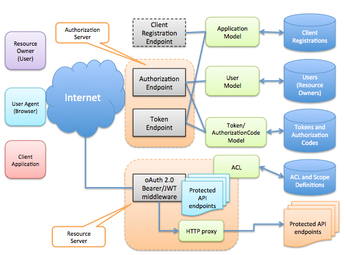
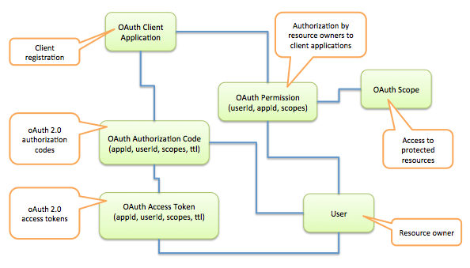

# Administrators Guide for StrongLoop API Gateway

## Overview

StrongLoop API gateway is a LoopBack application that provides the necessary 
infrastructure to serve your APIs to client applications over the Internet. 
It is a component within systems architecture to externalize, secure and manage 
APIs.  The API gateway sits as an intermediary between the many consumers of 
APIs - API clients and the many producers of the APIs on the backend - API 
servers.

StrongLoop API Gateway consists of the following modules:

- oAuth 2.0 provider for authentication and authorization
- API rate limiting
- API metrics and analytics
- API proxying

The key building blocks are illustrated below in the diagram.


## Typical Flow of an API request

1. The client application requests an access token from the oAuth 2.0 
authorization server.
2. The client application sends an API request with the access token to the 
oAuth 2.0 resource server.
3. The resource server validates the access token (including expiration, scope, 
client id and resource owner) to either allow or deny the access. If deny, an 
error response is sent to the client application and the flow terminates.
4. The metrics middleware captures the API usage and updates the metrics.
5. The rate limiting middleware introspects the API request and check the rate 
limits based on various keys. If it exceeds one of the limits, , an error 
response is sent to the client application and the flow terminates.
6. The proxy middleware looks up the routing configuration to decide if the 
request should be handled locally or forwarded to a remote API server.
7. The API server processes the request and produces a response.
8. The response is received by the proxy middleware, and then sent back to the 
original client application. 

## Understand oAuth 2.0 

[oAuth 2.0](https://tools.ietf.org/html/rfc6749) is an open standard for 
authorization. It grants client applications a secure delegated access to 
protected server resources on behalf of a resource owner (user). 
oAuth 2.0 also defines a process for resource owners to authorize third-party 
access to their server resources without sharing their credentials. 

StrongLoop API Gateway comes with an oAuth 2.0 provider that implements the 
oAuth 2.0 protocols and provides the persistence and management for metadata. 
The following diagram gives you a big picture about our oAuth 2.0 infrastructure. 



Before we go into details in setting up the oAuth 2.0 provider, let's go over
some of the important oAuth 2.0 concepts.

### oAuth 2.0 roles

#### Resource Owner

*An entity capable of granting access to a protected resource. When the 
resource owner is a person, it is referred to as an end-user.*

In LoopBack, we also refer to `Resource Owner` as `User`. It's backed by the 
User model or a sub-model of User. Each resource owner has a `id` (referenced 
as `userId`) and other properties such as `username` or `email`. Resource owners
can be authenticated by LoopBack using credentials, typically username or email 
with a matching password. 

#### Client

*An application making protected resource requests on behalf of the resource 
owner and with its authorization.  The term "client" does not imply any 
particular implementation characteristics (e.g., whether the application 
executes on a server, a desktop, or other devices).*

In LoopBack, we also refer to `Client` as `Application` or `Client Application`. 
It's backed by the Application model or a sub-model of Application. Each 
application has a `id` (referenced as `appId`) and other properties such as 
`name`. Client applications need to register with LoopBack first. More details 
will come later in this guide for the registration.

#### Authorization Server

The authorization server is responsible for issuing access tokens to the client 
after successfully authenticating the resource owner and obtaining authorization.

The server typically consists of a list of HTTP endpoints:

- Authorization endpoint: used by the client to obtain authorization from the 
resource owner via user-agent redirection.
- Token endpoint: used by the client to exchange an authorization grant for an 
access token, typically with client authentication
- Decision endpoint: used by the resource owner to allow or deny permission
requests from the client
- Login endpoint: used by the resource owner to authenticate itself with the 
system.

#### Resource Server

The resource server is responsible for validating access tokens and deciding if 
the client has permission to invoke APIs representing protected resources.

The server is configured with a `token` middleware to check the incoming 
requests for access tokens, establish the identity of client and resource 
owner, and control if the request can proceed to the API logic. 

Please note a user-agent (browser) can be involved for some of the interactions.
For example, the authorization server leverages HTTP redirection to call back 
with authorization code, token or error information. Resource owners also uses 
user-agent to log in or approve the permission request from client applications.

### Metadata Models

Metadata are critical for oAuth 2.0. StrongLoop API Gateway provides the 
management and persistence of oAuth metadata using LoopBack models, including: 

- User - representing resource owners
- OAuthClientApplication (extends from Application) - representing 
pre-registered client applications
- OAuthAccessToken - managing metadata attributes for access tokens, including 
scopes, ttl, userId, and appId.
- OAuthAuthorizationCode - managing metadata attributes for authorization codes, 
including scopes, ttl, userId, and appId.
- OAuthPermission - managing permissions granted by resource owners to clients




### Client Registration

Before a client can request access tokens from oAuth 2.0, it has to be 
registered with StrongLoop API Gateway first. See 
[OAuth2-Registeration](https://tools.ietf.org/html/draft-ietf-oauth-dyn-reg-24)
for more information about such requirement.

`loopback-component-oauth2` defines a sub model of `Application` to capture
 the necessary metadata for oAuth 2.0 client application registrations. It's 
 based on https://tools.ietf.org/html/draft-ietf-oauth-dyn-reg-24.

```
{
  "name": "OAuthClientApplication",
  "base": "Application",
  "properties": {
    "clientType": {
      "type": "string",
      "enum": ["public", "confidential"]
    },
    "redirectURIs": [ "string" ],
    "tokenEndpointAuthMethod": {
      "type": "string",
      "enum": ["none", "client_secret_post", "client_secret_basic"]
    },
    "grantTypes": [
      {
        "type": "string",
        "enum": ["authorization_code", "implicit", "client_credentials",
          "password", "urn:ietf:params:oauth:grant-type:jwt-bearer",
          "urn:ietf:params:oauth:grant-type:saml2-bearer"]
      }
    ],
    "responseTypes": [
      {
        "type": "string",
        "enum": ["code", "token"]
      }
    ],
    "tokenType": {
      "type": "string",
      "enum": ["bearer", "jwt", "mac"]
    },
    "clientSecret": "string",
    "clientName": "string",
    "clientURI": "string",
    "logoURI": "string",
    "scope": "string",
    "contacts": ["string"],
    "tosURI": "string",
    "policyURI": "string",
    "jwksURI": "string",
    "jwks": "string",
    "softwareId": "string",
    "softwareVersion": "string"
  }
}
```

In LoopBack, the client registration is achieved by creating an instance of 
Application model. An `client-id` and `client-secret` will be generated to 
authenticate the client.

Each application can be configured to constrain its permissions to request 
certain oAuth 2.0 flows. Let's explore some of the settings.

#### Supported Grant Types

LoopBack allows an application to request access tokens via one of the following 
grant types:

- implicit
- authorization_code
- client_credentials
- password
- urn:ietf:params:oauth:grant-type:jwt-bearer

#### Supported Response Types

LoopBack allows an application to use the authorization server with one of the 
following response types:

- token: implicit grant type
- code: authorization code grant type

#### Supported Token Types

LoopBack allows a client application to request access tokens of one of the 
following types:

- Bearer: plain bearer token, usually a hash generated by random. See
https://tools.ietf.org/html/rfc6750
- JWT: JWT based bearer token, usually signed with the client-secret as the 
secret. See https://tools.ietf.org/html/draft-ietf-oauth-json-web-token-32
- MAC: MAC (Message Authentication Code) based tokens. See 
https://tools.ietf.org/html/draft-ietf-oauth-v2-http-mac-05  

#### Scopes

oAuth 2.0 scopes are strings that enable access to particular protected 
resources, such as user data. Client applications include one or more scopes 
in certain authorization requests, which then displays appropriate permissions 
text in a consent dialog that is presented to a user. Once the user consents 
to the permissions, StrongLoop API Gateway sends back authorization code or 
access token, which identify the specific authorization grant. Each access token
is associated with some scopes (can be empty) which determine what user data 
the user gives the client application permission to access.

#### Redirect URIs

Redirect URIs are endpoints provided by client applications to receive 
authorization code or access token from the oAuth provider. It's critical 
to make sure redirect URIs are really controlled by the requesting client 
application. For authorization code and implicit grant types, the redirect URIs
should be pre-configured with the client registration. The oAuth provider will
validate the redirect_uri sent from the client.

When the client application exchanges the authorization code for an access 
token, it must pass in the same redirect_uri as what's used in the original 
request to receive the authorization code.

### Pre-authorized permissions

When a user grants permissions (represented as scopes) to client applications,
StrongLoop API Gateway can remember the decisions and store them in the 
`OAuthPermission` model. 
 
For client credentials or JWT client authentication grant types, pre-authorized
permissions must be established before a client application can send a request 
with a claim to represent a user to get access tokens.


## Provision oAuth 2.0 servers

Provision an oAuth 2.0 provider

server/component-config.json

```json
{
  "loopback-component-oauth2": {
    "dataSource": "db",
    "loginPage": "/login",
    "loginPath": "/login",
    "authorizationServer": true,
    "resourceServer": true
  }
}
```

- authorization server
- resource server


### Set up the persistence for oAuth 2.0 metadata

#### Configure the default data source

server/datasources.json
```json
{
  "db": {
    "name": "db",
    "connector": "mongodb"
    "host": "localhost",
    "port": 27017
  }
}
```

#### Install the connector

If you choose to use a different connector, please make sure the dependency
is installed for `strong-gateway`, for example,

```sh
npm install loopback-connector-mongodb --save
```

#### Set up the database

We provide a sample script to help you set up the database.

Run `node server/scripts/setup-db.js`

## Enforcing HTTPS

server/middleware.json

```json
 "routes:before": {
    "./middleware/https-redirect": {
      "params": {
        "httpsPort": 3001
      }
    },
```

### Enable API Metrics

server/middleware.json

```json
 "initial": {
    …
    "../strong-metrics/middleware/report-metrics": {
    }
  },
```  

### Enforce Rate Limiting

server/middleware.json

```json
"routes:after": {
    "./middleware/rate-limiting-policy": {
      "paths": ["/api", "/protected"],
      "params": {
        "limit": 100,  "interval": 60000,
        "keys": {
          "app": {"template": "app-${app.id}", "limit": 1000},
          "ip": 500,
          "url": {"template": "url-${urlPaths[0]}/${urlPaths[1]}", "limit": 1000},
          "user": {"template": "user-${user.id}", "limit": 1000},
          "app,user": {"template": "app-${app.id}-user-${user.id}", "limit": 1000}
        }}},
```

#### Configuration Properties

- limit
- interval
- keys (per key based limiting)
  - app
  - ip
  - url
  - user
  - app,user

### Reverse Proxy

server/middleware.json

```json
"routes:after": {
  "./middleware/proxy": {
      "params": {
        "rules": [
          "^/api/(.*)$ http://localhost:3002/api/$1 [P]"
        ]
      }
    }
}
```

#### Configuration
The "rules" is an array of rewrite rules. Each rewrite rule is a string with 
the syntax: `MATCHING_PATHS REPLACE_WITH [FLAGS]`. `MATCHING_PATHS` should be 
defined using a regex string. `REPLACE_WITH` is the replacement string for 
matching paths. Flags is optional and is defined using hard brackets. 
For proxies, the flag should be [P].

Use parenthesized submatch string as a parameter

See https://developer.mozilla.org/en-US/docs/Web/JavaScript/Reference/Global_Objects/String/replace#Specifying_a_string_as_a_parameter

For example, the rule `"^/api/(.*)$ http://localhost:3002/api/$1"` will 
replace `"/api/customers/1"` with `"http://localhost:3002/api/customers/1"` as 
`"customers/1"`is the submatch for `(.*)`.
